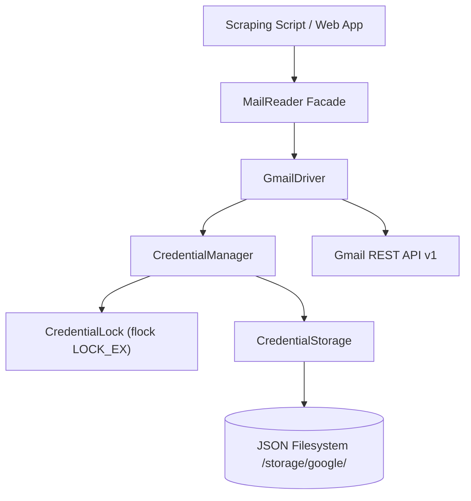

# GreatCode Mail Reader & Google OAuth Manager

[](https://php.net/)
[](LICENSE)
[](https://www.php-fig.org/psr/psr-12/)
[](src/)

A enterprise-grade, thread-safe, native PHP library designed for **automated mail reading, OTP code extraction in web scraping, and atomic Google OAuth credential management**.

Engineered specifically for high-concurrency production environments (PHP-FPM, Docker Replicas, Multi-Worker Scraping Pipelines) on shared Linux filesystems without requiring database dependencies.

---

## 🌟 Key Features

- **🔒 Thread-Safe & Race-Condition Proof:** Uses `flock(LOCK_EX)` on persistent `.lock` files to prevent concurrent workers or containers from triggering duplicate token refreshes simultaneously.
- **⚡ Atomic Storage:** File writes use temporary file buffering (`.tmp` -> `fflush()` -> `rename()`), ensuring JSON files are never corrupted even during sudden process termination or power loss.
- **🛡️ Automated Corruption Recovery:** Automatically recovers stored credentials from `.bak` backup files if primary JSON files are corrupted.
- **📧 Gmail REST API v1 Driver:** Native cURL HTTP transport wrapper for Gmail API—no heavy SDK dependencies required.
- **🔑 Automatic OTP Extraction:** Built-in heuristic engine for extracting 4–8 digit or alphanumeric verification codes from both English and Indonesian email payloads.
- **⏱️ Smart Polling Retry & Delay:** Retries message polling with customizable attempt limits and delay intervals until the email arrives.
- **📫 Auto Mark-as-Read:** Automatically marks processed emails as `READ` upon successfully retrieving OTP codes to prevent re-reading stale messages.
- **🎨 Glassmorphism Web UI:** Includes a single-line Web Registration handler (`MailReader::handleRegistration()`) with a responsive, modern HTML interface.
- **0️⃣ Zero Framework Dependencies:** Written in pure, strict-typed PHP 8.1+ adhering to PSR-12 standard.

---

## 🏗️ Architecture Overview



---

## 📦 Installation

Install via Composer:

```bash
composer require greatcode/otp-reader
```

---

## 🚀 Quick Start Guide

### 1. Read OTP for Web Scraping Scripts (1-Line Initialization)

```php
<?php

require_once __DIR__ . '/vendor/autoload.php';

use Mail\MailReader;

// 1. Initialize MailReader in 1 line
$mailReader = MailReader::createGmail(
    storageDirectory: __DIR__ . '/storage/google',
    clientId: getenv('GOOGLE_CLIENT_ID'),
    clientSecret: getenv('GOOGLE_CLIENT_SECRET')
);

// 2. Poll & extract OTP in 1 line
// Automatically retries 5 times with 2s delay, filters last 5 mins, and marks email as READ
$otp = $mailReader->getLatestOtp(
    email: 'user@gmail.com',
    from: 'tokopedia',
    afterTime: time() - 300
);

if ($otp !== null) {
    echo "✅ Extracted OTP: " . $otp;
} else {
    echo "❌ OTP not received within timeout.";
}
```

---

### 2. Custom Dynamic Body Parser Callable

If your email uses custom verification token formatting (e.g. `[AUTH-992810]`), pass a custom callable parser:

```php
use Mail\EmailMessage;

$token = $mailReader->getLatestOtp(
    email: 'user@gmail.com',
    from: 'service.com',
    afterTime: '10 minutes ago',
    parser: function (string $body, EmailMessage $message): ?string {
        if (preg_match('/\[AUTH-(\d{6})\]/', $body, $matches) === 1) {
            return $matches[1];
        }
        return null;
    },
    maxAttempts: 10,
    delaySeconds: 3
);
```

---

### 3. One-Line Web Account Registration UI (`register.php`)

Serve a self-contained, responsive Glassmorphism Web UI for registering accounts via browser in **a single line of code**:

```php
<?php

require_once __DIR__ . '/vendor/autoload.php';

use Mail\MailReader;

// Serves HTML page, handles form submissions, and saves OAuth refresh tokens
MailReader::handleRegistration(
    storageDirectory: __DIR__ . '/storage/google',
    clientId: getenv('GOOGLE_CLIENT_ID'),
    clientSecret: getenv('GOOGLE_CLIENT_SECRET')
);
```

Run local PHP server to test:

```bash
php -S localhost:8080 examples/register_web.php
```

Open browser at `http://localhost:8080` to access the registration UI.

---

## 📖 API Reference

### `MailReader`

| Method                                                                                           | Description                                                              |
| :----------------------------------------------------------------------------------------------- | :----------------------------------------------------------------------- |
| `createGmail($storageDir, $clientId, $clientSecret, $httpHandler = null)`                        | One-line static factory creating `MailReader` with Gmail Driver.         |
| `registerAccount($email, $refreshToken)`                                                         | Registers/updates an account's OAuth refresh token.                      |
| `getLatestOtp($email, $from, $afterTime, $parser, $maxAttempts, $delaySeconds, $autoMarkAsRead)` | Polls, extracts OTP, retries with delay, and auto-marks message as read. |
| `markAsRead($email, $messageId)`                                                                 | Marks a specific email message as read in Gmail.                         |
| `handleRegistration($storageDir, $clientId, $clientSecret)`                                      | Static helper for handling web HTTP requests and rendering HTML UI.      |

---

## 🛠️ Exception Hierarchy

All library exceptions extend from base exception classes:

```text
Google\Exceptions\CredentialException
 ├── CredentialNotFoundException
 ├── CredentialCorruptedException
 ├── CredentialLockException
 ├── CredentialRefreshException
 └── CredentialStorageException

Mail\Exceptions\MailReaderException
```

---

## 🧪 Testing

Run full PHPUnit test suite:

```bash
vendor/bin/phpunit
```

---

## 📜 License

This project is licensed under the MIT License - see the [LICENSE](LICENSE) file for details.
